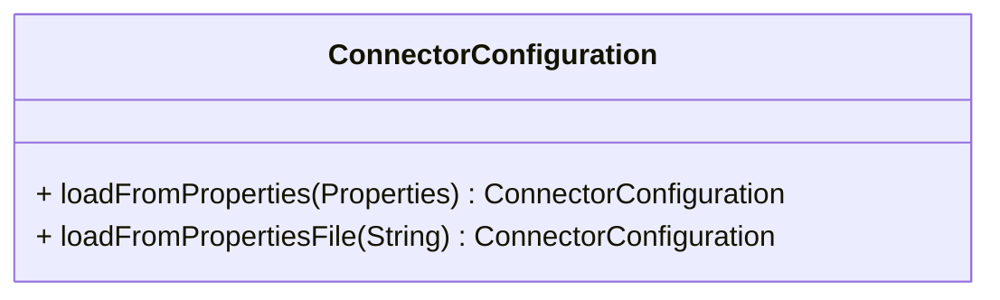
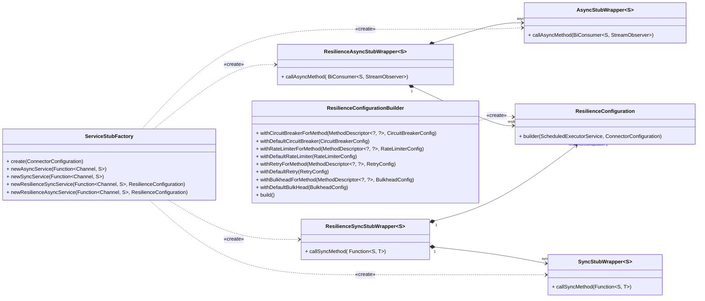
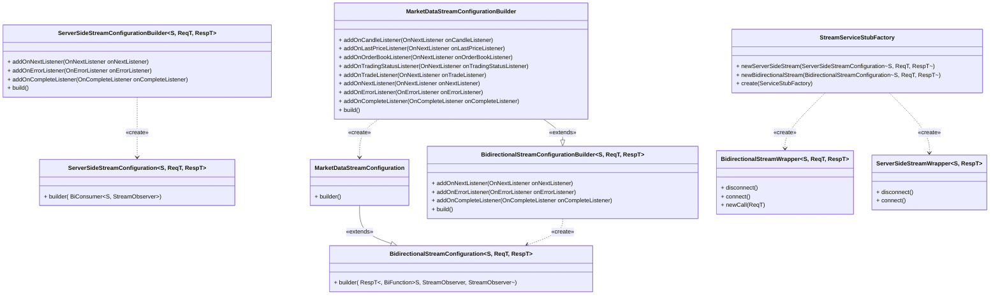
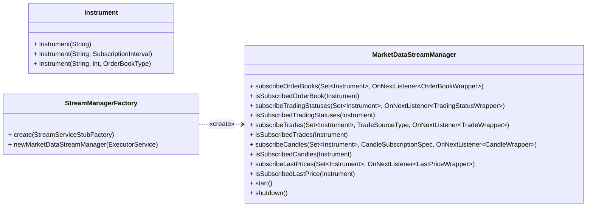

# Модуль java-sdk-core

Центральный модуль для работы с API Т-Инвестиций

## Содержание

* [Краткое описание API Т-Инвестиций](#краткое-описание-api-т-инвестиций)
* [Решаемые задачи модуля core](#решаемые-задачи-модуля-core)
* [Добавление модуля в проект](#добавление-модуля-в-проект)
* [Конфигурация клиента](#конфигурация-клиента)
* [Унарные запросы](#унарные-запросы)
    * [Синхронный](#синхронный)
    * [Асинхронный](#асинхронный)
* [Stream-соединения](#stream-соединения)
    * [Server-side](#server-side)
        * [Resilience server-side wrapper](#resilience-server-side-wrapper)
    * [Bidirectional](#bidirectional)
        * [Resilience market data wrapper](#resilience-market-data-wrapper)
    * [MarketDataStreamManager](#marketdatastreammanager)

## Краткое описание API Т-Инвестиций

API Т-Инвестиций поддерживает как одиночные (унарные) запросы, так и Stream-соединения.
Унарные запросы доступны для следующих сервисов::

* [InstrumentsService](https://developer.tbank.ru/invest/api/instruments-service)
* [MarketDataService](https://developer.tbank.ru/invest/api/market-data-service)
* [OperationsService](http://developer.tbank.ru/invest/api/operations-service)
* [OrdersService](https://developer.tbank.ru/invest/api/orders-service)
* [StopOrdersService](https://developer.tbank.ru/invest/api/stop-orders-service)
* [SandboxService](https://developer.tbank.ru/invest/api/sandbox-service)
* [UsersService](https://developer.tbank.ru/invest/api/users-service)
* SignalService
    * [GetSignals](https://developer.tbank.ru/invest/api/signal-service-get-signals)
    * [GetStrategies](https://developer.tbank.ru/invest/api/signal-service-get-strategies)

Stream-соединения бывают двух типов: server-side и bidirectional. Чем они отличаются?

* **Server-side**: подписка на данные происходит при подключении.
  Чтобы изменить подписку, необходимо закрыть текущий поток и открыть новый с обновленным запросом.
* **Bidirectional**: позволяет изменять подписки во время работы, без необходимости пересоздавать соединение.

Доступные **server-side** стримы:

* [PortfolioStream](https://developer.tbank.ru/invest/api/operations-stream-service-portfolio-stream)
* [PositionsStream](https://developer.tbank.ru/invest/api/operations-stream-service-positions-stream)
* [OrderStateStream](https://developer.tbank.ru/invest/api/orders-stream-service-order-state-stream)
* [TradesStream](https://developer.tbank.ru/invest/api/orders-stream-service-trades-stream)
* [MarketDataServerSideStream](https://developer.tbank.ru/invest/api/market-data-stream-service-market-data-stream)

Стрим предоставления биржевой информации также доступен в **bidirectional** варианте:

* [MarketDataStream](https://developer.tbank.ru/invest/api/market-data-stream-service-market-data-stream)

API Т-Инвестиций работает по протоколу [gRPC](https://grpc.io/). который позволяет генерировать код клиента на различных
языках программирования из контрактов (proto-файлов). Модуль core представляет собой обёртку над сгенерированным кодом
на Java, что позволяет использовать gRPC-сервисы в их исходной форме без обёрток.

## Решаемые задачи модуля core

* Предоставление интерфейса для работы с API Т-Инвестиций
* Обёртки для работы с унарными запросами, **server-side** и **bidirectional** стримами
* Логгирование и трассировка запросов
* Обработка ошибок и повторные попытки (retry)
* Поддрежка конфигурации [resilience4j](https://resilience4j.readme.io/v1.7.0/docs/getting-started) для унарных запросов
* Объединение стримов рыночных данных в один поток с помощью [MarketDataStreamManager](#marketdatastreammanager)

## Добавление модуля в проект

<details>
<summary>Maven</summary>

```xml

<dependency>
    <groupId>ru.tinkoff.piapi</groupId>
    <artifactId>java-sdk-core</artifactId>
    <version>1.40</version>
</dependency>
```

</details>
<details>
<summary>Gradle</summary>

```groovy
implementation 'ru.tinkoff.piapi:java-sdk-core:1.40'
```

</details>

## Конфигурация клиента

Конфигурацию клиента можно задать в properties файле в classpath

```properties
token=t.*****
connection.timeout=30000
connection.keepalive=60000
connection.max-message-size=16777216
connection.retry.max-attempts=3
connection.retry.wait-duration=2000
grpc.debug=false
grpc.context-fork=true
target=invest-public-api.tinkoff.ru:443
sandbox.target=sandbox-invest-public-api.tinkoff.ru:443
sandbox.enabled=false
stream.market-data.max-streams-count=16
stream.market-data.max-subscriptions-count=300
stream.inactivity-timeout=10000
stream.ping-delay=5000
```

Подробнее о каждом параметре:

* `token` - [токен](https://developer.tbank.ru/invest/intro/intro/token) доступа к API Т-Инвестиций
* `connection.timeout` - таймаут соединения в миллисекундах
* `connection.keepalive` - интервал проверки соединения в миллисекундах
* `connection.max-message-size` - максимальный размер сообщения в байтах
* `connection.retry.max-attempts` - максимальное количество попыток отправки запроса
* `connection.retry.wait-duration` - интервал ожидания между попытками отправки запроса в миллисекундах
* `grpc.debug` - включение отладочной информации
* `grpc.context-fork` - включение форка контекста
* `target` - URL API Т-Инвестиций
* `sandbox.target` - URL API песочницы Т-Инвестиций
* `sandbox.enabled` - включение песочницы
* `stream.market-data.max-streams-count` - максимальное количество стримов для рыночных данных
  (используется в `MarketDataStreamManager`)
* `stream.market-data.max-subscriptions-count` - максимальное количество подписок на рыночные данные в одном стриме
  (используется в [MarketDataStreamManager](#marketdatastreammanager))
* `stream.inactivity-timeout` - таймаут отсутствия сообщений в стриме в миллисекундах
*  `stream.ping-delay` - интервал пинга в стриме в миллисекундах

> **Примечание**
> <br>Зачения по умолчанию соответствуют представленным выше</br>

За загрузку конфигурации подключения из файла/объекта `Properties` и её хранение отвечает `ConnectorConfiguration`
<details>
<summary>Класс ConnectorConfiguration</summary>



</details>

> **Примечание**
> <br>Далее будут приведены примеры кода на Java, в которых в качестве ресурса для `ConnectorConfiguration` указан файл
> `invest.properties`. Содержание этого файла соотвествует представленному выше</br>

## Унарные запросы

<details>
<summary>Диаграмма классов</summary>



</details>

Есть два вида выполнения унарных запросов на клиенте:

* [Синхронный](#синхронный)
* [Асинхронный](#асинхронный)

### Синхронный

Вид запросов, блокирующих выполнение программы до получения ответа от сервера.
Чтобы выполнить такой запрос, необходимо будет создать экземпляр `SyncStubWrapper`.

<details>
<summary>Пример блокирующего запроса без resilience</summary>

```java
class Main {
    public static void main(String[] args) {
        var configuration = ConnectorConfiguration.loadFromPropertiesFile("invest.properties");
        var unaryServiceFactory = ServiceStubFactory.create(configuration);
        var instrumentsService = unaryServiceFactory.newSyncService(InstrumentsServiceGrpc::newBlockingStub);
        var response = instrumentsService.callSyncMethod(stub -> stub.shares(InstrumentsRequest.getDefaultInstance()));
    }
}
```

</details>

Для поддержки механизма resilience можно использовать класс `ResilienceSyncStubWrapper`, который включает retry,
bulkhead, rate-limiting и circuit-breaker. По сути это обёртка над `SyncStubWrapper`

<details>
<summary>Пример блокирующего запроса с resilience</summary>

```java
class Main {
    public static void main(String[] args) {
        var configuration = ConnectorConfiguration.loadFromPropertiesFile("invest.properties");
        var unaryServiceFactory = ServiceStubFactory.create(configuration);
        var executorService = Executors.newSingleThreadScheduledExecutor();
        var instrumentsResilienceService = unaryServiceFactory.newResilienceSyncService(
                InstrumentsServiceGrpc::newBlockingStub,
                ResilienceConfiguration.builder(executorService, configuration)
                        .withDefaultRetry(RetryConfig.custom().waitDuration(Duration.ofMillis(3000)).maxAttempts(5).build())
                        .build()
        );
        var response = instrumentsResilienceService.callSyncMethod(
                InstrumentsServiceGrpc.getSharesMethod(),
                stub -> stub.shares(InstrumentsRequest.getDefaultInstance())
        );
    }
}
```

</details>

### Асинхронный

Запросы, возвращающие `CompletableFuture`, которые могут быть обработаны позже. Не блокирует выполнение программы.
Чтобы выполнить такой запрос, необходимо будет создать экземпляр `AsyncStubWrapper`.

<details>
<summary>Пример асинхронного запроса без resilience</summary>

```java
class Main {
    public static void main(String[] args) {
        var configuration = ConnectorConfiguration.loadFromPropertiesFile("invest.properties");
        var unaryServiceFactory = ServiceStubFactory.create(configuration);
        var instrumentsService = unaryServiceFactory.newAsyncService(MarketDataServiceGrpc::newStub);
        var request = GetLastPricesRequest.newBuilder()
                .addInstrumentId("87db07bc-0e02-4e29-90bb-05e8ef791d7b")
                .build();
        CompletableFuture<GetLastPricesResponse> response = instrumentsService.callAsyncMethod(
                (stub, observer) -> stub.getLastPrices(request, observer)
        );
    }
}
```

</details>

Для поддержки resilience можно использовать `ResilienceAsyncStubWrapper`. Как и в случае с синхронным вызовом,
это обёртка над `AsyncStubWrapper`.
<details>
<summary>Пример асинхронного запроса с resilience</summary>

```java
class Main {
    public static void main(String[] args) {
        var configuration = ConnectorConfiguration.loadFromPropertiesFile("invest.properties");
        var unaryServiceFactory = ServiceStubFactory.create(configuration);
        var executorService = Executors.newSingleThreadScheduledExecutor();
        var instrumentsService = unaryServiceFactory.newResilienceAsyncService(
                MarketDataServiceGrpc::newStub,
                ResilienceConfiguration.builder(executorService, configuration)
                        .withDefaultRetry(RetryConfig.custom().waitDuration(Duration.ofMillis(3000)).maxAttempts(5).build())
                        .build()
        );
        var request = GetLastPricesRequest.newBuilder()
                .addInstrumentId("87db07bc-0e02-4e29-90bb-05e8ef791d7b")
                .build();
        CompletableFuture<GetLastPricesResponse> response = instrumentsService.callAsyncMethod(
                MarketDataServiceGrpc.getGetLastPricesMethod(),
                (stub, observer) -> stub.getLastPrices(request, observer)
        );
    }
}
```

</details>

> **Примечание**
> <br>По умолчанию конфигурация настроена только для retry, однако можно настроить другие компоненты resilience</br>

## Stream-соединения

<details>
<summary>Диаграмма классов</summary>



</details>

SDK предоставляет удобные обёртки для работы со стримами. Они позволяют устанавливать листенеры
(например, `OnNextListener`, `OnErrorListener`, `OnCompleteListener`) для получения данных.

### Server-side

Для создания server-side стрима используется класс `ServerSideStreamWrapper`.

<details>
<summary>Пример работы с ServerSideStreamWrapper</summary>

```java
public class Main {
    public static void main(String[] args) {
        var configuration = ConnectorConfiguration.loadFromPropertiesFile("invest.properties");
        var unaryServiceFactory = ServiceStubFactory.create(configuration);
        var streamFactory = StreamServiceStubFactory.create(unaryServiceFactory);
        var request = OrderStateStreamRequest.newBuilder()
                .addAccounts("123456789")
                .build();
        var serverSideStream = streamFactory.newServerSideStream(
                ServerSideStreamConfiguration.builder(
                                OrdersStreamServiceGrpc::newStub,
                                OrdersStreamServiceGrpc.getOrderStateStreamMethod(),
                                (stub, observer) -> stub.orderStateStream(request, observer))
                        .addOnNextListener(markerDataResponse -> System.out.println("Сообщение: " + markerDataResponse))
                        .addOnErrorListener(throwable -> System.out.println("Произошла ошибка: " + throwable.getMessage()))
                        .addOnCompleteListener(() -> System.out.println("Стрим завершен"))
                        .build()
        );
        serverSideStream.connect();
    }
}
```

</details>

#### Resilience server-side wrapper

Для упрощения работы с server-side стримами и повышения их надёжности был создан `ResilienceServerSideStreamWrapper`.
Он инициирует автоматическое переподключение стрима и повторную отправку последнего успешного запроса на подписку,
если в стриме отсуствовала активность в течение заданного в параметрах `stream.inactivity-timeout`.
Чтобы получить экземпляр `ResilienceServerSideStreamWrapper`, необходимо создать один из вариантов конфигурации `ResilienceServerSideStreamWrapperConfiguration`:
* `OrderStateStreamWrapperConfiguration`
* `TradeStreamWrapperConfiguration`
* `PortfolioStreamWrapperConfiguration`
* `PositionStreamWrapperConfiguration`

<details>
<summary>Пример создания ResilienceServerSideStreamWrapper для OrderStateStream</summary>

```java
public class Main {

  public static void main(String[] args) {
    var configuration = ConnectorConfiguration.loadFromPropertiesFile("invest.properties");
    var factory = ServiceStubFactory.create(configuration);
    var streamFactory = StreamServiceStubFactory.create(factory);
    var executorService = Executors.newSingleThreadScheduledExecutor();
    var wrapper = streamFactory.newResilienceServerSideStream(OrderStateStreamWrapperConfiguration.builder(executorService)
      .addOnResponseListener(orderState -> System.out.println("Order state: " + orderState))
      .addOnConnectListener(() -> System.out.println("Successful reconnection!"))
      .build());
    var request = OrderStateStreamRequest.newBuilder()
      .addAccounts("123456789")
      .build();
    wrapper.subscribe(request);
  }
}
```
</details>

### Bidirectional

Для работы с bidirectional стримами используется класс `BidirectionalStreamWrapper`.

<details>
<summary>Пример работы с BidirectionalStreamWrapper</summary>

```java
public class Main {
    public static void main(String[] args) {
        var configuration = ConnectorConfiguration.loadFromPropertiesFile("invest.properties");
        var unaryServiceFactory = ServiceStubFactory.create(configuration);
        var streamFactory = StreamServiceStubFactory.create(unaryServiceFactory);
        var request = MarketDataRequest.newBuilder()
                .setSubscribeLastPriceRequest(
                        SubscribeLastPriceRequest.newBuilder()
                                .addInstruments(LastPriceInstrument.newBuilder()
                                        .setInstrumentId("87db07bc-0e02-4e29-90bb-05e8ef791d7b")
                                        .build())
                                .build())
                .build();
        var stream = streamFactory.newBidirectionalStream(
                BidirectionalStreamConfiguration.builder(
                                MarketDataStreamServiceGrpc::newStub,
                                MarketDataStreamServiceGrpc.getMarketDataStreamMethod(),
                                MarketDataStreamServiceGrpc.MarketDataStreamServiceStub::marketDataStream)
                        .addOnNextListener(markerDataResponse -> System.out.println("Сообщение: " + markerDataResponse))
                        .addOnErrorListener(throwable -> System.out.println("Произошла ошибка: " + throwable.getMessage()))
                        .addOnCompleteListener(() -> System.out.println("Стрим завершен"))
                        .build()
        );
        stream.connect();
        stream.newCall(request);
    }
}
 ```

</details>

> **Примечание**
> <br>Для bidirectional стрима необходимо отправить запрос на подписку, чтобы получать данные</br>

Также для более удобной работы с `MarketDataStreamService` при создании `BidirectionalStreamWrapper`
можно передать конфигурацию `MarketDataStreamConfiguration`.

<details>
<summary>Пример работы с BidirectionalStreamWrapper созданным с конфигурацией MarketDataStreamConfiguration</summary>

```java
public class Main {
    public static void main(String[] args) {
        var configuration = ConnectorConfiguration.loadFromPropertiesFile("invest.properties");
        var unaryServiceFactory = ServiceStubFactory.create(configuration);
        var streamFactory = StreamServiceStubFactory.create(unaryServiceFactory);
        var request = MarketDataRequest.newBuilder()
                .setSubscribeLastPriceRequest(
                        SubscribeLastPriceRequest.newBuilder()
                                .addInstruments(LastPriceInstrument.newBuilder()
                                        .setInstrumentId("87db07bc-0e02-4e29-90bb-05e8ef791d7b")
                                        .build())
                                .build()
                )
                .build();
        var stream = streamFactory.newBidirectionalStream(
                MarketDataStreamConfiguration.builder()
                        .addOnCandleListener(candle -> System.out.println("Свеча: " + candle))
                        .addOnLastPriceListener(lastPrice -> System.out.println("Цена: " + lastPrice))
                        .addOnTradeListener(trade -> System.out.println("Сделка: " + trade))
                        .addOnNextListener(response -> System.out.println("Сообщение: " + response))
                        .addOnErrorListener(e -> System.out.println("Произошла ошибка: " + e.getMessage()))
                        .addOnCompleteListener(() -> System.out.println("Стрим завершен"))
                        .build()
        );
        stream.connect();
        stream.newCall(request);
    }
}
```

</details>

Нужно учитывать, что листенеры в `MarketDataStreamConfiguration` возвращают Wrapper-объекты над сгенерированными
gRPC объектами. Это нужно для удобной работы с ценами и временем, так как в gRPC используется свой Timestamp
для времени и Quotation для чисел с плавающей запятой. Wrapper преобразует их в LocalDateTime и BigDecimal
соответственно.
Подробнее про нестандартные типы данных
в [документации](https://developer.tbank.ru/invest/intro/intro/faq_custom_types).

#### Resilience market data wrapper

Для повышения надёжности при работе с `MarketDataStream` был создан `MarketDataStreamWrapper`. Он инициирует
автоматическое переподключение стрима и повторную отправку последнего успешного запроса на подписку, если в стриме
отсуствовала активность в течение заданного в параметрах `stream.inactivity-timeout`.

<details>
<summary>Пример работы с MarketDataStreamWrapper</summary>

```java
public class Main {
  public static void main(String[] args) {
    var configuration = ConnectorConfiguration.loadFromPropertiesFile("invest.properties");
    var factory = ServiceStubFactory.create(configuration);
    var streamFactory = StreamServiceStubFactory.create(factory);
    var executorService = Executors.newSingleThreadScheduledExecutor();
    var wrapper = streamFactory.newResilienceMarketDataStream(
      MarketDataStreamWrapperConfiguration.builder(executorService)
        .addOnCandleListener(response -> logger.info("New candle for instrument: {}", response.getInstrumentUid()))
        .build());
    var request = MarketDataRequest.newBuilder()
      .setSubscribeCandlesRequest(SubscribeCandlesRequest.newBuilder()
        .setSubscriptionAction(SubscriptionAction.SUBSCRIPTION_ACTION_SUBSCRIBE)
        .addInstruments(CandleInstrument.newBuilder()
          .setInstrumentId("9978b56f-782a-4a80-a4b1-a48cbecfd194")
          .setInterval(SubscriptionInterval.SUBSCRIPTION_INTERVAL_ONE_MINUTE)
          .build())
        .setWaitingClose(true)
        .build())
      .build();
    wrapper.subscribe(request);
  }
}
```
</details>

### MarketDataStreamManager

<details>
<summary>Диаграмма классов</summary>



</details>

Ещё одной удобной обёрткой над bidirectional-стримами MarketDataStream является `MarketDataStreamManager`.
Необходим менеджер для того, чтобы избавить пользователя от необходимости заботиться о количестве подписок и
их распределении по стримам. Необходимость эта исходит из ограничений
API ([лимиты](https://developer.tbank.ru/invest/intro/intro/limits#грейды)).
Менеджер в свою очередь позволяет объединить подписки со всех стримов в один общий поток данных и обрабатывать их в
листенерах.

<details>
<summary>Пример работы с MarketDataStreamManager</summary>

```java
public class Main {
    public static void main(String[] args) {
        var configuration = ConnectorConfiguration.loadFromPropertiesFile("invest.properties");
        var unaryServiceFactory = ServiceStubFactory.create(configuration);
        var streamServiceFactory = StreamServiceStubFactory.create(unaryServiceFactory);
        var streamManagerFactory = StreamManagerFactory.create(streamServiceFactory);
        var executorService = Executors.newCachedThreadPool();
        var marketDataStreamManager = streamManagerFactory.newMarketDataStreamManager(executorService);
        marketDataStreamManager.subscribeLastPrices(
                Set.of(new Instrument("87db07bc-0e02-4e29-90bb-05e8ef791d7b")),
                candle -> System.out.println("New last price incoming for instrument: " + candle.getInstrumentUid())
        );
        marketDataStreamManager.start();
    }
}
```

</details>

> **Примечание**
> <br>При использовании `MarketDataStreamManager` важно не забыть вызвать метод `start()`. Сделать это можно как до
> подписки,
> так и после неё. Этот метод запускает обработку поступающих в листенеры данных</br>
