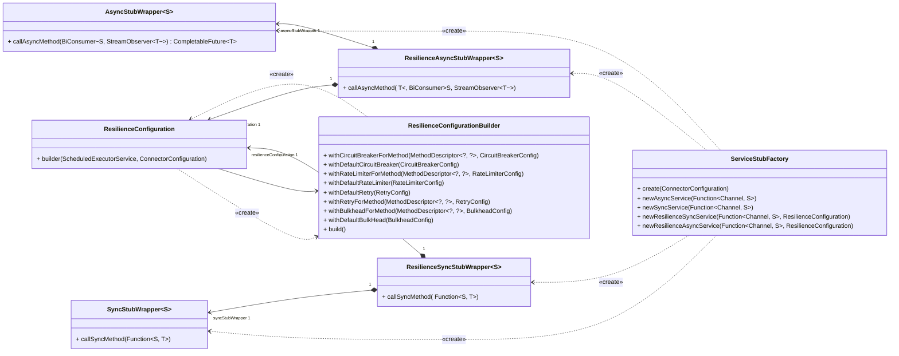
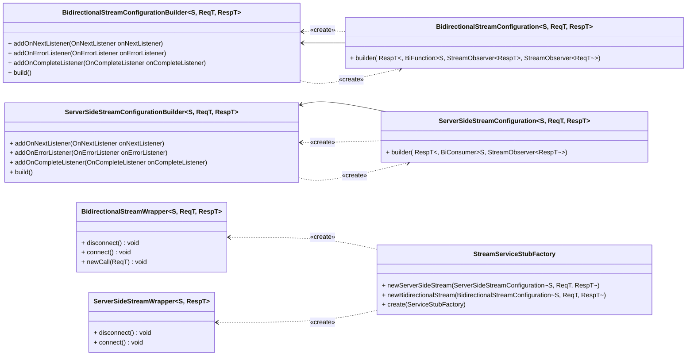

# Модуль java-sdk-core
## Унарные запросы

Есть два подхода при работе с унарными запросами:
 * **Синхронные запросы**
 <br> Такие запросы блокируют выполнение кода, пока не придёт ответ от сервера.
 Чтобы выполнить такой запрос, необходимо будет создать экземпляр `SyncStubWrapper`:
   ```java
   class Main {
    public static void main(String[] args){
         var configuration = ConnectorConfiguration.loadFromPropertiesFile("invest.properties");
         var unaryServiceFactory = ServiceStubFactory.create(configuration);
         var instrumentsService = unaryServiceFactory.newSyncService(InstrumentsServiceGrpc::newBlockingStub);
         var response = instrumentsService.callSyncMethod(stub -> stub.shares(InstrumentsRequest.getDefaultInstance()));
    }
   }
   ```
   Также можно создать resilience-версию `ResilienceSyncStubWrapper`, которая поддерживает retry, bulkhead, rate-limiting и circuit-breaker:
   ```java
   class Main {
    public static void main(String[] args){
        var configuration = ConnectorConfiguration.loadFromPropertiesFile("invest.properties");
        var unaryServiceFactory = ServiceStubFactory.create(configuration);
        var executorService = Executors.newSingleThreadScheduledExecutor();
        var instrumentsResilienceService = unaryServiceFactory.newResilienceSyncService(
            InstrumentsServiceGrpc::newBlockingStub,
            ResilienceConfiguration.builder(executorService, configuration)
                .withDefaultRetry(RetryConfig.custom().waitDuration(Duration.ofMillis(3000)).maxAttempts(5).build())
                .build()
        );
        var response = instrumentsResilienceService.callSyncMethod(
            InstrumentsServiceGrpc.getSharesMethod(),
            stub -> stub.shares(InstrumentsRequest.getDefaultInstance())
        );
    }
   }
   ```
   * **Асинхронные запросы**
   <br>Запросы, возвращающие `CompletableFuture`, который впоследствии может быть обработан так, как Вам необходимо.
   Чтобы выполнить такой запрос, необходимо будет создать экземпляр `AsyncStubWrapper`:
     ```java
     class Main {
        public static void main(String[] args) {
            var configuration = ConnectorConfiguration.loadFromPropertiesFile("invest.properties");
            var unaryServiceFactory = ServiceStubFactory.create(configuration);
            var instrumentsService = unaryServiceFactory.newAsyncService(MarketDataServiceGrpc::newStub);
            var request = GetLastPricesRequest.newBuilder()
                .addInstrumentId("87db07bc-0e02-4e29-90bb-05e8ef791d7b")
                .build();
            CompletableFuture<GetLastPricesResponse> response = instrumentsService.callAsyncMethod(
                (stub, observer) -> stub.getLastPrices(request, observer)
            );
        }
     }
     ```
     Также можно создать resilience-версию `ResilienceAsyncStubWrapper`, которая поддерживает retry,
     bulkhead, rate-limiting и circuit-breaker:
     ```java
     class Main {
        public static void main(String[] args) {
           var configuration = ConnectorConfiguration.loadFromPropertiesFile("invest.properties");
           var unaryServiceFactory = ServiceStubFactory.create(configuration);
           var executorService = Executors.newSingleThreadScheduledExecutor();
           var instrumentsService = unaryServiceFactory.newResilienceAsyncService(
                MarketDataServiceGrpc::newStub,
                ResilienceConfiguration.builder(executorService, configuration)
                    .withDefaultRetry(RetryConfig.custom().waitDuration(Duration.ofMillis(3000)).maxAttempts(5).build())
                    .build()
           );
           var request = GetLastPricesRequest.newBuilder()
                   .addInstrumentId("87db07bc-0e02-4e29-90bb-05e8ef791d7b")
                   .build();
           CompletableFuture<GetLastPricesResponse> response = instrumentsService.callAsyncMethod(
                MarketDataServiceGrpc.getGetLastPricesMethod(),
                (stub, observer) -> stub.getLastPrices(request, observer)
           );
        }
     }
     ```
 _Примечание: конфигурация по умолчанию настроена только для retry,
 но Вы можете самостоятельно настроить нужную конфигурацию для остальных компонент resilience_

## Server-side и bidirectional стримы

