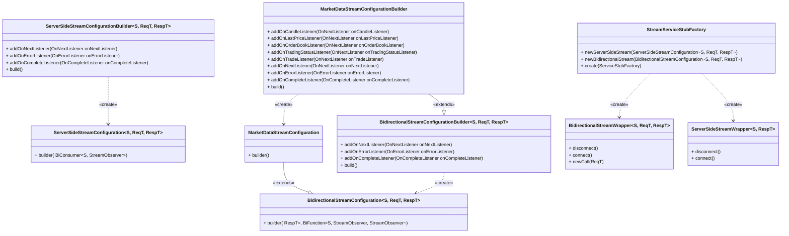

# Модуль java-sdk-core
Центральный модуль для работы с API Т-Инвестиций
## Конфигурация клиента
Конфигурацию клиента можно задать в properties файле в classpath
```properties
token=t.*****
connection.timeout=30000
connection.keepalive=60000
connection.max-message-size=16777216
connection.retry.max-attempts=3
connection.retry.wait-duration=2000
grpc.debug=false
grpc.context-fork=true
target=invest-public-api.tinkoff.ru:443
sandbox.target=sandbox-invest-public-api.tinkoff.ru:443
sandbox.enabled=false
stream.market-data.max-streams-count=16
stream.market-data.max-subscriptions-count=300
```
Подробнее о каждом параметре:
* `token` - [токен](https://developer.tbank.ru/invest/intro/intro/token) доступа к API Т-Инвестиций
* `connection.timeout` - таймаут соединения
* `connection.keepalive` - интервал проверки соединения
* `connection.max-message-size` - максимальный размер сообщения в байтах
* `connection.retry.max-attempts` - максимальное количество попыток отправки запроса
* `connection.retry.wait-duration` - интервал ожидания между попытками отправки запроса
* `grpc.debug` - включение отладочной информации
* `grpc.context-fork` - включение форка контекста
* `target` - URL API Т-Инвестиций
* `sandbox.target` - URL API песочницы Т-Инвестиций
* `sandbox.enabled` - включение песочницы
* `stream.market-data.max-streams-count` - максимальное количество стримов для рыночных данных
  (используется в `MarketDataStreamManager`)
* `stream.market-data.max-subscriptions-count` - максимальное количество подписок на рыночные данные в одном стриме
(используется в `MarketDataStreamManager`)

_Примечание: зачения по умолчанию соответствуют представленным выше_

За загрузку конфигурации подключения из файла/объекта `Properties` и её хранение отвечает `ConnectorConfiguration`

## Унарные запросы

Есть два подхода при работе с унарными запросами:
### Синхронный
 Вид запросов, блокирующий выполнение кода, пока не придёт ответ от сервера.
 Чтобы выполнить такой запрос, необходимо будет создать экземпляр `SyncStubWrapper`:
```java
class Main {
    public static void main(String[] args){
        var configuration = ConnectorConfiguration.loadFromPropertiesFile("invest.properties");
        var unaryServiceFactory = ServiceStubFactory.create(configuration);
        var instrumentsService = unaryServiceFactory.newSyncService(InstrumentsServiceGrpc::newBlockingStub);
        var response = instrumentsService.callSyncMethod(stub -> stub.shares(InstrumentsRequest.getDefaultInstance()));
    }
}
```
Также можно создать resilience-версию `ResilienceSyncStubWrapper`, которая поддерживает retry, bulkhead,
rate-limiting и circuit-breaker:
```java
class Main {
    public static void main(String[] args){
        var configuration = ConnectorConfiguration.loadFromPropertiesFile("invest.properties");
        var unaryServiceFactory = ServiceStubFactory.create(configuration);
        var executorService = Executors.newSingleThreadScheduledExecutor();
        var instrumentsResilienceService = unaryServiceFactory.newResilienceSyncService(
            InstrumentsServiceGrpc::newBlockingStub,
            ResilienceConfiguration.builder(executorService, configuration)
                .withDefaultRetry(RetryConfig.custom().waitDuration(Duration.ofMillis(3000)).maxAttempts(5).build())
                .build()
        );
        var response = instrumentsResilienceService.callSyncMethod(
            InstrumentsServiceGrpc.getSharesMethod(),
            stub -> stub.shares(InstrumentsRequest.getDefaultInstance())
        );
    }
}
```
### Асинхронные запросы
Запросы, возвращающие `CompletableFuture`, который впоследствии может быть обработан так, как Вам необходимо.
Чтобы выполнить такой запрос, необходимо будет создать экземпляр `AsyncStubWrapper`:
```java
class Main {
    public static void main(String[] args) {
        var configuration = ConnectorConfiguration.loadFromPropertiesFile("invest.properties");
        var unaryServiceFactory = ServiceStubFactory.create(configuration);
        var instrumentsService = unaryServiceFactory.newAsyncService(MarketDataServiceGrpc::newStub);
        var request = GetLastPricesRequest.newBuilder()
                .addInstrumentId("87db07bc-0e02-4e29-90bb-05e8ef791d7b")
                .build();
        CompletableFuture<GetLastPricesResponse> response = instrumentsService.callAsyncMethod(
                (stub, observer) -> stub.getLastPrices(request, observer)
        );
    }
}
```
Также можно создать resilience-версию `ResilienceAsyncStubWrapper`, которая поддерживает retry,
bulkhead, rate-limiting и circuit-breaker:
```java
class Main {
    public static void main(String[] args) {
        var configuration = ConnectorConfiguration.loadFromPropertiesFile("invest.properties");
        var unaryServiceFactory = ServiceStubFactory.create(configuration);
        var executorService = Executors.newSingleThreadScheduledExecutor();
        var instrumentsService = unaryServiceFactory.newResilienceAsyncService(
                MarketDataServiceGrpc::newStub,
                ResilienceConfiguration.builder(executorService, configuration)
                        .withDefaultRetry(RetryConfig.custom().waitDuration(Duration.ofMillis(3000)).maxAttempts(5).build())
                        .build()
        );
        var request = GetLastPricesRequest.newBuilder()
                .addInstrumentId("87db07bc-0e02-4e29-90bb-05e8ef791d7b")
                .build();
        CompletableFuture<GetLastPricesResponse> response = instrumentsService.callAsyncMethod(
                MarketDataServiceGrpc.getGetLastPricesMethod(),
                (stub, observer) -> stub.getLastPrices(request, observer)
        );
    }
}
```
_Примечание: конфигурация по умолчанию настроена только для retry,
но Вы можете самостоятельно настроить нужную конфигурацию для остальных компонент resilience_

## Server-side и bidirectional стримы

SDK предоставляет удобные обёртки для работы со стримами, которые позволяют получать данные через листенеры
(`OnNextListener`, `OnErrorListener`, `OnCompleteListener`)
 ### Server-side стрим
 Для создания server-side стрима необходимо создать экземпляр `ServerSideStreamWrapper`:
```java
public class Main {
    public static void main(String[] args) {
        var configuration = ConnectorConfiguration.loadFromPropertiesFile("invest.properties");
        var unaryServiceFactory = ServiceStubFactory.create(configuration);
        var streamFactory = StreamServiceStubFactory.create(unaryServiceFactory);
        var request = OrderStateStreamRequest.newBuilder()
            .addAccounts("123456789")
            .build();
        var serverSideStream = streamFactory.newServerSideStream(
                ServerSideStreamConfiguration.builder(
                            OrdersStreamServiceGrpc::newStub,
                            OrdersStreamServiceGrpc.getOrderStateStreamMethod(),
                            (stub, observer) -> stub.orderStateStream(request, observer))
                        .addOnNextListener(markerDataResponse -> System.out.println("Сообщение: " + markerDataResponse))
                        .addOnErrorListener(throwable -> System.out.println("Произошла ошибка: " + throwable.getMessage()))
                        .addOnCompleteListener(() -> System.out.println("Стрим завершен"))
                        .build()
        );
        serverSideStream.connect();
    }
  }
```
### Bidirectional стрим
Работа с bidirectional стримами происходит через `BidirectionalStreamWrapper`:
```java
public class Main {
    public static void main(String[] args) {
        var configuration = ConnectorConfiguration.loadFromPropertiesFile("invest.properties");
        var unaryServiceFactory = ServiceStubFactory.create(configuration);
        var streamFactory = StreamServiceStubFactory.create(unaryServiceFactory);
        var request = MarketDataRequest.newBuilder()
                .setSubscribeLastPriceRequest(
                        SubscribeLastPriceRequest.newBuilder()
                                .addInstruments(LastPriceInstrument.newBuilder()
                                .setInstrumentId("87db07bc-0e02-4e29-90bb-05e8ef791d7b")
                                .build())
                          .build())
                .build();
        var stream = streamFactory.newBidirectionalStream(
                BidirectionalStreamConfiguration.builder(
                        MarketDataStreamServiceGrpc::newStub,
                        MarketDataStreamServiceGrpc.getMarketDataStreamMethod(),
                        MarketDataStreamServiceGrpc.MarketDataStreamServiceStub::marketDataStream)
                .addOnNextListener(markerDataResponse -> System.out.println("Сообщение: " + markerDataResponse))
                .addOnErrorListener(throwable -> System.out.println("Произошла ошибка: " + throwable.getMessage()))
                .addOnCompleteListener(() -> System.out.println("Стрим завершен"))
                .build()
       );
       stream.connect();
       stream.newCall(request);
    }
  }
 ```
Стоит отметить, что по определению двустороннего стрима для получения данных в нём нужно
сначала отправить какой-либо запрос на подписку в этот стрим.

Также для более удобной работы с `MarketDataStreamService` при создании `BidirectionalStreamWrapper`
можно передать конфигурацию `MarketDataStreamConfiguration`:
```java
public class Main {
    public static void main(String[] args) {
        var configuration = ConnectorConfiguration.loadFromPropertiesFile("invest.properties");
        var unaryServiceFactory = ServiceStubFactory.create(configuration);
        var streamFactory = StreamServiceStubFactory.create(unaryServiceFactory);
        var request = MarketDataRequest.newBuilder()
                .setSubscribeLastPriceRequest(
                        SubscribeLastPriceRequest.newBuilder()
                                .addInstruments(LastPriceInstrument.newBuilder()
                                        .setInstrumentId("87db07bc-0e02-4e29-90bb-05e8ef791d7b")
                                        .build())
                                .build()
                )
                .build();
        var stream = streamFactory.newBidirectionalStream(
                MarketDataStreamConfiguration.builder()
                        .addOnCandleListener(candle -> System.out.println("Свеча: " + candle))
                        .addOnLastPriceListener(lastPrice -> System.out.println("Цена: " + lastPrice))
                        .addOnTradeListener(trade -> System.out.println("Сделка: " + trade))
                        .addOnNextListener(response -> System.out.println("Сообщение: " + response))
                        .addOnErrorListener(e -> System.out.println("Произошла ошибка: " + e.getMessage()))
                        .addOnCompleteListener(() -> System.out.println("Стрим завершен"))
                        .build()
        );
        stream.connect();
        stream.newCall(request);
    }
  }
```
Нужно учитывать, что листенеры в `MarketDataStreamConfiguration` возвращают Wrapper-объекты над сгенерированными
gRPC объектами. Это нужно для удобной работы с ценами и временем, так как в gRPC используется свой Timestamp
для времени и Quotation для чисел с плавающей запятой. Wrapper преобразует их в LocalDateTime и BigDecimal
соответственно.

### MarketDataStreamManager

Ещё одной удобной обёрткой над bidirectional-стримами MarketDataStream является `MarketDataStreamManager`.
Он позволяет объединить подписки со всех стримов в один общий поток данных и обрабатывать их в листенерах.
```java
public class Main {
    public static void main(String[] args) {
        var configuration = ConnectorConfiguration.loadFromPropertiesFile("invest.properties");
        var unaryServiceFactory = ServiceStubFactory.create(configuration);
        var streamServiceFactory = StreamServiceStubFactory.create(unaryServiceFactory);
        var streamManagerFactory = StreamManagerFactory.create(streamServiceFactory);
        var executorService = Executors.newCachedThreadPool();
        var marketDataStreamManager = streamManagerFactory.newMarketDataStreamManager(executorService);
        marketDataStreamManager.subscribeLastPrices(
                Set.of(new Instrument("87db07bc-0e02-4e29-90bb-05e8ef791d7b")),
                candle -> logger.info("New last price incoming for instrument: {}", candle.getInstrumentUid())
        );
        marketDataStreamManager.start();
    }
}
```
